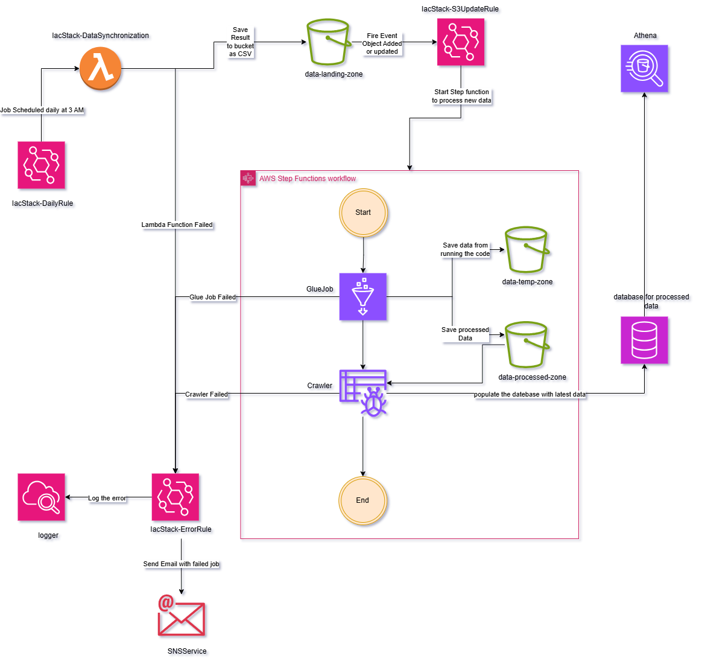

# Project Overview

This project converts energy price data from a wide format to a long format and makes it queryable via AWS Athena. The data is sourced from an API endpoint and processed through a series of AWS services to ensure it is transformed and stored efficiently for analysis.

# Architecture

The system is designed with the following components:

- A Lambda function is scheduled to run daily at 03:00 AM. This function retrieves the latest data from an API endpoint and stores it in an S3 bucket named `data-landing-zone`.
- An S3 event notification (watcher) is set up on the `data-landing-zone` bucket. When a new file is created or an existing one is updated, it triggers a Step Function.
- The Step Function orchestrates a Glue job that performs the following tasks:
  - Converts the data from wide to long format.
  - Adds a timestamp column, adjusting for Daylight Saving Time (DST) based on German time zones.
  - Generates a new timestamp column to make the data searchable in both local and UTC time.
- After the Glue job completes, a Glue crawler is triggered to update the AWS Glue Data Catalog, making the transformed data available for querying via AWS Athena.

A diagram illustrating this architecture can be found at `./example-data/aws_diagram.png`:



# Deployment Instructions

To deploy this project, follow these steps:

1. Ensure you have Node.js installed. If not, download and install it from [here](https://nodejs.org/en/download).
2. Navigate to the `iac` directory:
   ```bash
   cd iac
   ```
3. Install the necessary dependencies:
   ```bash
   npm install
   ```
4. Bootstrap the AWS CDK environment (replace `ACCOUNT-ID` and `REGION` with your AWS account ID and desired region):
   ```bash
   cdk bootstrap aws://ACCOUNT-ID/REGION
   ```
5. Synthesize the CDK stack:
   ```bash
   cdk synth
   ```
6. Deploy the stack:
   ```bash
   cdk deploy
   ```

# Data Simulation for Testing

To simulate data and test the pipeline, use the provided Python script:

- Ensure you have the required libraries installed by running:
  ```bash
  pip install -r requirements.txt
  ```
- Run the simulator with the following command:
  ```bash
  python data_generation_simulator.py --update-delay <minutes> --generate-mode <daily|monthly> --region <aws-region>
  ```
  - `--update-delay`: Time in minutes between generating new data points.
  - `--generate-mode`: Choose `daily` to generate data day by day or `monthly` for a whole month.
  - `--region`: Specify your AWS region.

# Continuous Integration and Continuous Deployment (CI/CD)

To enable CI/CD for this project, configure OpenID Connect (OIDC) by following these resources:

- [YouTube Tutorial](https://www.youtube.com/watch?v=aOoRaVuh8Lc)
- [GitHub Documentation](https://docs.github.com/en/actions/security-for-github-actions/security-hardening-your-deployments/configuring-openid-connect-in-amazon-web-services)

# Simulating the API for Lambda Function

To test the Lambda function with a mock API:

1. Create a mock API endpoint using [Mocky](https://designer.mocky.io/).
2. Copy the contents of `example-data/germany_energy_prices_2024.csv` into the mock response body.
3. Set the response type to `text/csv`.
4. Update the API endpoint URL in the CDK stack file located at `iac/lib/iac-stack.ts` on line 346 with your new Mocky URL.